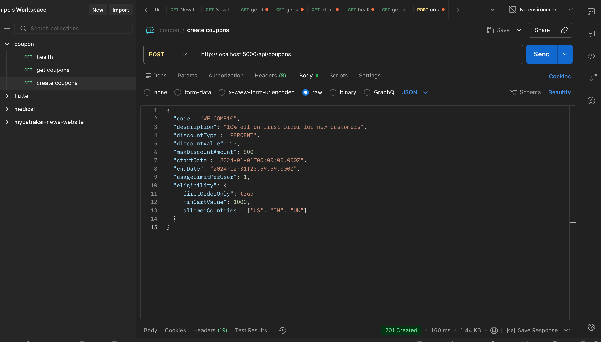
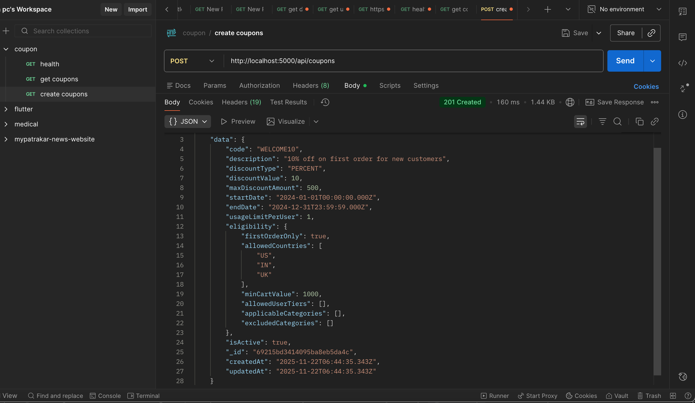
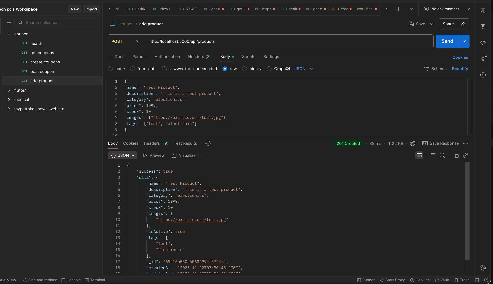
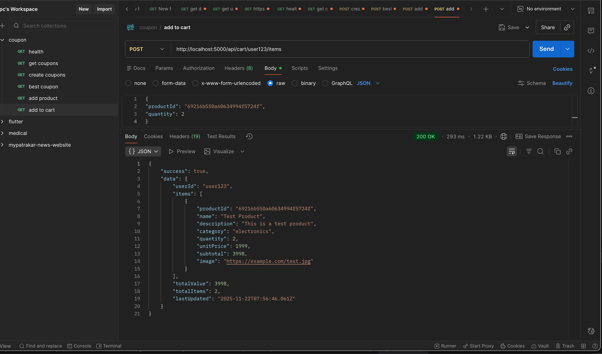
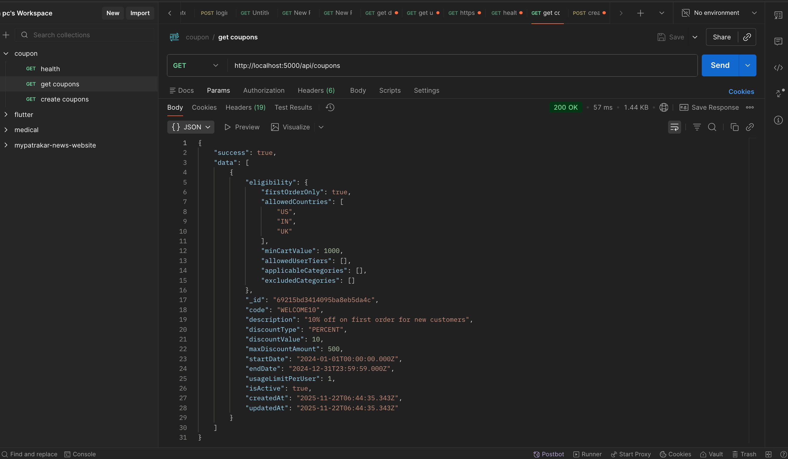
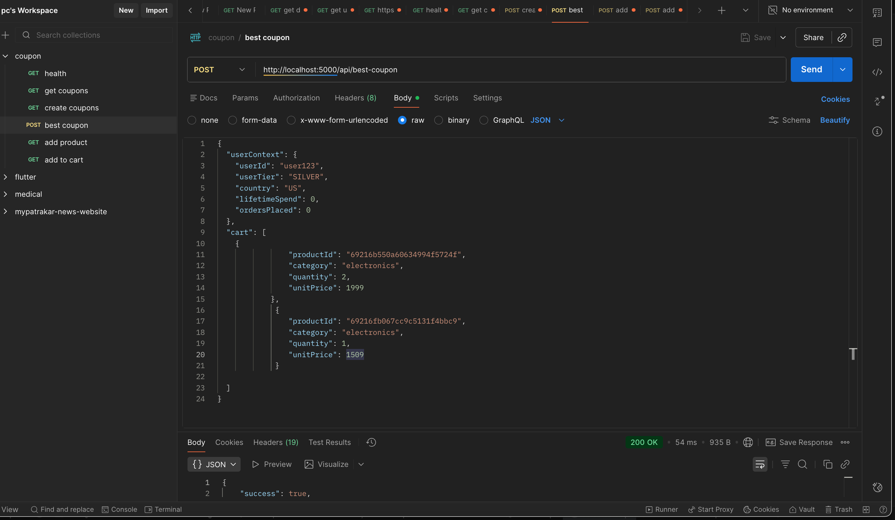

# Coupon Management System

A functional programming-based coupon management system built with Node.js, Express, and MongoDB.

## Features

- Create and manage coupons with complex eligibility rules
- Find the best applicable coupon for a user's cart
- Functional programming paradigm with pure functions
- Comprehensive validation and error handling
- MongoDB persistence with efficient queries

## API Endpoints

### POST /api/coupons
Create a new coupon.

**Body:**
```json
{
  "code": "SUMMER20",
  "description": "20% off summer sale",
  "discountType": "PERCENT",
  "discountValue": 20,
  "maxDiscountAmount": 1000,
  "startDate": "2024-06-01T00:00:00Z",
  "endDate": "2024-08-31T23:59:59Z",
  "usageLimitPerUser": 2,
  "eligibility": {
    "minCartValue": 2000,
    "allowedUserTiers": ["SILVER", "GOLD", "PLATINUM"],
    "applicableCategories": ["clothing", "shoes"]
  }
}


## Product & Cart Management

### Product Endpoints

#### POST /api/products
Create a new product.

**Body:**
```json
{
  "name": "Product Name",
  "description": "Product description",
  "category": "clothing",
  "price": 999,
  "stock": 50,
  "images": ["https://example.com/image.jpg"],
  "tags": ["men", "cotton"]
}


## 📸 Screenshots

### Create Coupon


### Create Coupon Response


### Duplicate Coupon Code Error


### Create Product


### Add to Cart


### Get All Coupons


### Get Best Coupon

